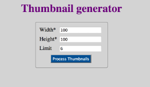
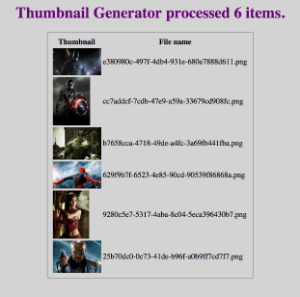

# ManageImage#Sujet

Vous allez réaliser une application de création de thumbnails.
Vous avez sur votre disque un dossier contenant des images (pouvant être dans une arborescence).
Ces images ont malheureusement une résolution assez grande, et on se propose de créer un service qui permettra de les redimensionner et de les télécharger à la demande.

Parce que cette création pourra être demandée à la fois depuis un client web ou des clients mobiles, nous allons créer à la fois une page dynamique, et une API REST pour déclencher les opérations.

1. Faire en sorte que le projet compile en utilisant maven.
2. Ajouter Spring et Spring-mvc au projet.
3. Compléter les méthodes qui ne sont pas implémentées dans List<String> processImages(int width, int height) List<String> processImages(int width, int height, int limit) dans ThumbnailServiceImpl.
4. Implémenter le DAO, vous utiliserez hibernate, avec l’API de votre choix (Criteria, HQL, QueryDSL, Spring Data JPA…). Vous avez le droit de modifier la classe.
5. Réaliser l’API Rest de l’application
6. Réaliser l'interface à l'aide de spring-mvc, qui contiendra:  
   Un formulaire (index.jsp, mappé sur "/") où vous définirez les dimensions du cadre des thumbnails: width(px), height(px), et la limite (de façon optionnelle). Lors de la soumission, il validera le contenu à l’aide d’un validateur spring, puis effectuera la conversion.  
     
   Une seconde page avec un tableau qui contient les images, et leurs noms si tout s’est bien passé, une erreur sinon.  
     
   Vous utiliserez les formulaires spring et la JSTL. Pour faciliter la correction, mettre l'attribut id du formulaire à "thumbnailRequestForm".  
   Implémenter le controlleur ThumbnailController correspondant, les classes thumbnailRequest et thumbnailResponse sont fournies.  
   Pour votre formulaire, vous mettrez en place une validation spring uniquement (pas besoin de validation jquery).  
7. Persister les opérations dans la base de données, de manière transactionnelle. Les informations de connexion vous seront fournies.    

#Consignes

Vous utiliserez le squelette fourni. Il comprend:  
 - L’interface du service (vous pouvez y ajouter des annotations, mais pas changer la signature des méthodes), ainsi que celle du DAO.  
 - Une implémentation presque complète du service  
 - Des classes model  
 - Vous utiliserez Spring, Spring-MVC, Jackson, API Java Time, Hibernate, et Maven  
 - Vous utiliserez un fichier properties (fourni) que vous adapterez de façon adéquate (avec votre nom), et que vous utiliserez dans votre code.  
 - Vous avez le droit de faire étendre l’interface du DAO (par exemple par une interface CrudRepository ou autre...), ou de l’implémenter manuellement au choix.  
 - Vous avez le droit d’utiliser internet, ainsi que vos projets respectifs. Vous n’avez cependant pas le droit d’interagir "avec le monde extérieur" pendant le test.  
 - Vous réaliserez les 4 premiers points en premier dans l'ordre, puis vous pourrez réaliser les points 5, 6 et 7 dans l'ordre que vous préférez. Faites au plus vite.  
 

#L’API rest:
**[POST] /thumbnails/{width}/{height}**  
Params:  
`width: the max width of the processed thumbnail`  
`height: the max height of the processed thumbnail`

Returns:    
 - **200-OK** si tout s’est bien passé, avec un JSON qui répertorie le nombre et le nom des images générées    
Exemple:  
```
{
  « processed »: 2,
  « thumbnails »: [
    « thumb-0azbjdfj34.png », « thumb-29egus73.png » 
    ]
}
```  
 - **400-BAD-REQUEST** si l’un des arguments est inférieur à 10
 - **500-INTERNAL-SERVER-ERROR** sinon  

**[POST] /thumbnails/{width}/{height}/{limit}**  
Params:  
`width: the max width of the processed thumbnail`  
`height: the max height of the processed thumbnail`  
`limit: the maximum number of thumbnails`  

Returns:  
 - **200-OK** si tout s’est bien passé, avec un JSON qui répertorie le nombre et le nom des images générées:  
Exemple:  
```{
  « processed »: 2,
  « thumbnails »: [
    « thumb-0azbjdfj34.png », « thumb-29egus73.png » 
    ]
}```  
 - **400-BAD-REQUEST** si width ou height est inférieur à 10 ou limit est inférieur à 0
 - **500-INTERNAL-SERVER-ERROR** sinon  

**[GET] /thumbnails/{fileName}**  
Params:  
`fileName: the thumbnail file name to retrieve`  
Returns:  
 - **200-OK** et un byte[] contenant l’image demandée  
 - **500-INTERNAL-SERVER-ERROR** sinon

# Accès BDD  
Les accès à la base de données sont les suivants:  
host: mysql:jdbc://……./pnom  
username: pnom  
password: toor  
(p étant la première lettre du prénom, n votre nom, comme vos identifiants email excilys)
  
# Ressources de test
Le dossier images de test vous est fourni (dans images/). Il contient une arborescence avec des images disséminées à l'intérieur.  
Vous l'utiliserez pour vos tests.
